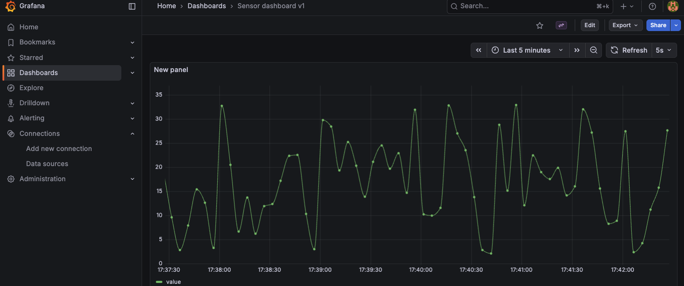

# HiveMQ + Prometheus + Grafana stack

### Notice:

Make sure the promethius extention JARfile (https://github.com/hivemq/hivemq-prometheus-extension/releases/download/4.0.15/hivemq-prometheus-extension-4.0.15.zip) is in the Promethius extention directory.

### How to run:

```docker compose up -d```

### Access:

2. [HiveMQ Control Center](http://localhost:8080) (cc-admin / cc-password)
3. MQTT broker: `tcp://localhost:1883` (full control: superuser / admin)
4. [Prometheus](http://localhost:9090)
5. [Grafana sensor](http://localhost:3000/d/adz87kc/sensor-dashboard-v1?orgId=1&from=now-5m&to=now&timezone=browser&refresh=5s) (admin/admin)
6. [Grafana HiveMQ metrics](http://localhost:3000/d/8912167a-09ef-4320-9716-f27842f7b88f/hivemq-platform-prometheus?orgId=1&from=now-30m&to=now&timezone=browser&var-Prometheus=PBFA97CFB590B2093&var-intervalSeconds=30&var-Route=total&refresh=5s) (admin/admin)

### for more info see:

https://www.hivemq.com/blog/visualizing-hivemq-cluster-and-node-metrics-grafana/
https://github.com/hivemq/hivemq-grafana-dashboards
https://docs.hivemq.com/hivemq-enterprise-security-extension/latest/getting-started.html#getting-started-with-sql-databases

### Local database

The local Postgres database is used as both security provider for the ESE extention as for timeseries data storage.

On Docker host `postgres` on port `5432`, in database `mydb` with username `myuser` and as password `mypassword`.
See tables `tempdata` and `users`

### Check MQTT on CLI

[mqtt](https://github.com/hivemq/mqtt-cli) sub -t "#"

### example JSON value as published by simulator

`{"temperature": 3.97, "isotime": "2026-01-19T11:49:39.172Z", "SensorID": "TempSimulator", "unixtime": 1768823379172}`

#### Security test:

##### Non TLS:

[mqtt](https://github.com/hivemq/mqtt-cli) sub -t "#" -u superuser -pw admin -p 1883 -J | jq                  # file based auth`

[mqtt](https://github.com/hivemq/mqtt-cli) sub -t "#" -u superuser -pw supersecurepassword -p 1884 -J | jq    # DB based auth`

##### TLS test (file based auth)

[mqtt](https://github.com/hivemq/mqtt-cli) test  -h localhost  -p 8883  --secure  --cafile hivemq.crt  -u superuser -pw admin                                                 `

### Grafana query used by sensor graph:



`SELECT isotime AS "time",      -- Time column for X-axis temperature AS "value"  -- Value column for Y-axis FROM tempdata ORDER BY isotime ASC;`

### SImulator

✅ Successfully published to 'sensors/temperature': {"temperature": 29.48, "isotime": "2026-02-16T16:59:07.164Z", "SensorID": "TempSimulator", "unixtime": 1771261147164}

