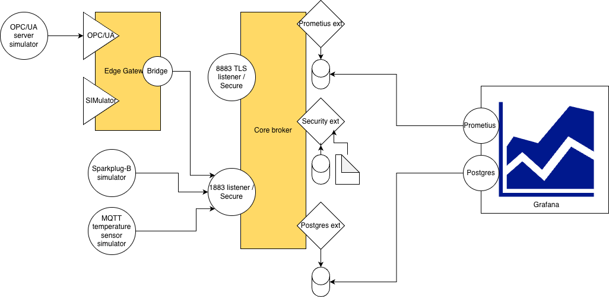

# HiveMQ + Prometheus + Grafana stack

~/Documents/Testing/HMQ-Prom-Garfana

### Notice:

Make sure the promethius extention JARfile (https://github.com/hivemq/hivemq-prometheus-extension/releases/download/4.0.15/hivemq-prometheus-extension-4.0.15.zip) is in the Promethius extention directory.

### How to run:

```docker compose up -d```

### What you get

This will setup a docker compose based infra with a HiveMQ Edge bridged into a HiveMQ core broker, an OPC/UA simulator, a Postgress database to store both HiveMQ security details as well as MQTT based generated data recieved from MQTT and OPC/UA datasources. The last will be visualised by a Grafana instance that also dispays HiveMQ broker metrics retrived via the Promethius extenton/database methodology.



### Access:

2. [HiveMQ Control Center](http://localhost:8080) (cc-admin / cc-password)
3. MQTT broker: `tcp://localhost:1883` (full control: superuser / admin)
4. [Prometheus](http://localhost:9090)
5. [Grafana sensor](http://localhost:3000/d/adz87kc/sensor-dashboard-v1?orgId=1&from=now-5m&to=now&timezone=browser&refresh=5s) (admin/admin)
6. [Grafana HiveMQ metrics](http://localhost:3000/d/8912167a-09ef-4320-9716-f27842f7b88f/hivemq-platform-prometheus?orgId=1&from=now-30m&to=now&timezone=browser&var-Prometheus=PBFA97CFB590B2093&var-intervalSeconds=30&var-Route=total&refresh=5s) (admin/admin)
7. [Edge Gui](http://127.0.0.1:2080/app/login)
8. [OPC-UA browser](http://127.0.0.1:2304/)
9. [Kafka / RedPanda console](http://localhost:8099/overview)
10. [MQTT web explorer](http://localhost:5000/)

### for more info see:

https://www.hivemq.com/blog/visualizing-hivemq-cluster-and-node-metrics-grafana/
https://github.com/hivemq/hivemq-grafana-dashboards
https://docs.hivemq.com/hivemq-enterprise-security-extension/latest/getting-started.html#getting-started-with-sql-databases

### Local database

The local Postgres database is used as both security provider for the ESE extention as for timeseries data storage.

On Docker host `postgres` on port `5432`, in database `mydb` with username `myuser` and as password `mypassword`.
See tables `tempdata` and `users`

The HiveMQ Postgres extention uses a external SQL command file containing the Postgres directly insert method with JSON decoding:

```
INSERT INTO tempdata (sensorid,isotime, unixtime, temperature)
SELECT
json_data->>'SensorID' AS sensorid,
(json_data->>'isotime'):: timestamp AS isotime,
(json_data->>'unixtime')::numeric AS isotime,
(json_data->>'temperature')::numeric AS temperature /* casting from text to numic value ! */
FROM (
VALUES
( ${mqtt-payload-utf8}::jsonb)
) AS input(json_data);
```

### Check MQTT on CLI

test all:
[mqtt](https://github.com/hivemq/mqtt-cli) test  -u superuser -pw admin -p 1883 (with security enabled)

[mqtt](https://github.com/hivemq/mqtt-cli) sub -t "#"

### example JSON value as published by simulator

`{"temperature": 3.97, "isotime": "2026-01-19T11:49:39.172Z", "SensorID": "TempSimulator", "unixtime": 1768823379172}`

#### Security test:

##### Non TLS:

[mqtt](https://github.com/hivemq/mqtt-cli) sub -t "#" -u superuser -pw admin -p 1883 -J | jq                  # file based auth`

[mqtt](https://github.com/hivemq/mqtt-cli) sub -t "#" -u superuser -pw supersecurepassword -p 1884 -J | jq    # DB based auth`

##### TLS test (file based auth)

[mqtt](https://github.com/hivemq/mqtt-cli) test  -h localhost  -p 8883  --secure  --cafile hivemq.crt  -u superuser -pw admin                                                 `

### Grafana query used by sensor graph:


`SELECT isotime AS "time",      -- Time column for X-axis temperature AS "value"  -- Value column for Y-axis FROM tempdata ORDER BY isotime ASC;`

### SImulator

✅ Successfully published to 'sensors/temperature': {"temperature": 29.48, "isotime": "2026-02-16T16:59:07.164Z", "SensorID": "TempSimulator", "unixtime": 1771261147164}

### Rest API

```curl -X GET "http://127.0.0.1:8888/api/v1/mqtt/clients" -H "accept: application/json" | jq```


### Datahub

Add  "BrokerIsoTime" and "BrokerUTCTime" by importing module DH-AddContext/Add_time_context-1.0.0.module file (CC v1 or API only!)

```
curl -X GET "http://127.0.0.1:8888/api/v1/data-hub/modules/instances" \
-H "accept: application/json" | jq

curl -X PATCH "http://127.0.0.1:8888/api/v1/data-hub/modules/instances/instance-blBUr" \
     -H "Content-Type: application/json" \
     -H "accept: application/json" \
     -d '{
       "enabled": false
     }'
```     

#### Pipeline Module deployment and enablement

Read the (zipped) moidule file, encode it to base64 (removing line breaks) and pipe it into jq to build the final API payload 

```
jq -n \
  --arg mod "$(base64 -i Add_time_context-1.0.0.module)" \
  --argjson cfg "$(cat config.json)" \
  '{module: $mod, moduleConfiguration: $cfg}' | \
curl -X POST "http://127.0.0.1:8888/api/v1/data-hub/modules/instances" \
     -H "Content-Type: application/json" \
     -H "accept: application/json" \
     -d @-
```

## ===== scratch zone =====

send message to edge broker:
mqtt pub -h 127.0.0.1 -p 2883 -t test -m kamielisgek123

monitor core broker:
mqtt sub -t "#"  -u superuser -pw admin -p 1883 -J | jq

monitor edge on MQTT:
mqtt sub -t "#"   -p 2883 -J  | jq

mqtt test -h localhost -p 9999  --secure  --cafile hivemq.crt  -u superuser -pw admin    
    
mqtt test -h localhost -p 9999  --secure  --cafile hivemq.crt  -u superuser -pw admin \
--cert mqtt-client-cert.pem --key mqtt-client-key.pem  


curl -X GET "http://127.0.0.1:8888/api/v1/data-hub/modules/instances" -H "accept: application/json" | jq

curl -X PATCH "http://127.0.0.1:8888/api/v1/data-hub/modules/instances/instance-blBUr" \
     -H "Content-Type: application/json" \
     -H "accept: application/json" \
     -d '{
       "enabled": false
     }'


# Read the file, encode it to base64 (removing line breaks), and pipe it into jq to build the final API payload
jq -n \
  --arg mod "$(base64 -i Add_time_context-1.0.0.module)" \
  --argjson cfg "$(cat config.json)" \
  '{module: $mod, moduleConfiguration: $cfg}' | \
curl -X POST "http://127.0.0.1:8888/api/v1/data-hub/modules/instances" \
     -H "Content-Type: application/json" \
     -H "accept: application/json" \
     -d @-